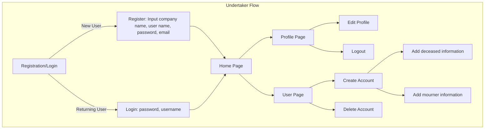
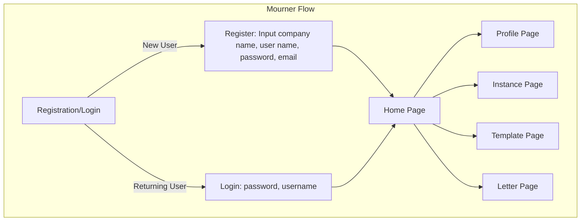

<!-- TODO -->

# Functional Specification Document - AfterWords <!-- omit in toc -->

 Table Of Contents 

- [Introduction](#introduction)
  - [Purpose](#purpose)
  - [Scope](#scope)
    - [In-scope](#in-scope)
    - [Out-of-scope](#out-of-scope)
  - [Audience](#audience)
  - [Definitions And Acronyms](#definitions-and-acronyms)
- [Overview](#overview)
- [Functional Requirements](#functional-requirements)
  - [Use Cases](#use-cases)
    - [Creating A New Account](#creating-a-new-account)
    - [Select Instances](#select-instances)
    - [Uploading Documents](#uploading-documents)
    - [Send Letters To All Instances](#send-letters-to-all-instances)
  - [Personas](#personas)
  - [User Roles And Permissions](#user-roles-and-permissions)
    - [Administrator](#administrator)
    - [Undertakers](#undertakers)
    - [Mourners](#mourners)
  - [System Features And Functions](#system-features-and-functions)
  - [Application Workflow](#application-workflow)
- [Non-Functional Requirement](#non-functional-requirement)
- [Design](#design)
  - [Wireframes](#wireframes)
  - [Mock Ups](#mock-ups)
    - [Colors](#colors)
    - [Visuals](#visuals)
- [Data Management](#data-management)
  - [Data Flow](#data-flow)
  - [Database Schema](#database-schema)
- [External Interfaces](#external-interfaces)
- [Constraints And Limitations](#constraints-and-limitations)
- [Acceptance Criteria](#acceptance-criteria)
- [Appendices](#appendices)

## Introduction

### Purpose
<!-- - Briefly describe the purpose of the document and the system/product it defines.   -->
---

Afterwords is an application allowing mourning people to get some help on the administration part. \
It would ease the process by gathering all instances in one place. \
How would that work?
The mourner just have to enter all the different instances and the required documents. Once it would be done, they would have to complete some templates of letters to send them all in one click.

---

### Scope  
<!-- - Define the boundaries of the system, including what it will and will not cover.   -->
---

#### In-scope

---

AfterwWords will cover the different subject hereunder:

- It will suggest many letters template, allowing users to have a wider range of choice to complete and write there own letters.
- It will also gather french instances (such as EDF, France connect, ...) in one place.
- Users can chose the intended instances by checking their names within a page.
- AfterWords would have a database to store all the necessary documents for the said instances above.
- AfterWords would save time and energy to mourners.

---

#### Out-of-scope

---

The following points are what AfterWords will not do:

- AfterWords won't display user's information withinvthe application.
- It would not do administartion pe=rocedures for the user.
- It won't dispose of a messagerie within the application, the user will need to have an e-mail address of there own.
- Users can't organize funerals within the application.

---

### Audience  
<!-- - Specify who the intended readers are (developers, testers, stakeholders, etc.).   -->
---

AfterWords will have to target audience. \
The first hand audience would be undertakers company. AfterWords would be a service they could share, sell to their own customers, the second and final target audience of AfterWords, mourning people.

The mourning people are the main audience of this project. AfterWords is meant to help them through a difficult pass which is grieving. However, AfterWords won't be accessible on Internet in free-access. It would be unseen, that's why undertakers have a key role in this project.

---

### Definitions And Acronyms  
<!-- - List key terms and abbreviations with their explanations.   -->
---

---

## Overview

---

## Functional Requirements

### Use Cases
<!-- - Describe major use cases and user interactions with the system.   -->
---

#### Creating A New Account

---

**Actor**: undertakers \
**Goal**: user wants to create an account

**Preconditions**:

- User is logged in.
- User is in the `New Account Page`.
- User has all needed mourner's personal information.

**Basic Flow**:

1. Click on `New Account`.
2. Enter deceased personal information (death date, full name, last location, birth date, birth location).
3. Enter Mourner personal information (parenthood, full name).
4. Confirm.

> [!Warning] Alternate Flows
>
> - The deceased already have an account.
> - Failed due to missing information.

**Postconditions**:

- AfterWords generate a password.
- Undertaker transmit account and password to mourner.

---

#### Select Instances

---

**Actor**: mourner \
**Goal**: user wants to contact instances

**Preconditions**:

- User is logged in.
- User is in the `Instance Page`.

**Basic Flow**:

1. Search for instance name in search bar.
2. Click the checkbox to add it to `Instance to contact`.
3. Repeat the process for every instance.

> [!Warning] Alternate Flows
> Instance not registered

**Postconditions**:

- Instance saved in `Instance to contact`.

---

#### Uploading Documents

---

**Actor**: mourner \
**Goal**: user wants to upload documents for procedure.

**Preconditions**:

- User is logged in.
- User is in the `Your Documents Page`.

**Basic Flow**:

1. Open a teb with all your documents locally.
2. Select the documents you want to upload.
3. Drag & drop them into the `Document container`.
4. Confirm the upload.

> [!Warning] Alternate Flows
>
> - The document the user want to upload already is uploaded.
> - No document given to the `Document container`.

**Postconditions**:

- Documents saved within your account.

---

#### Send Letters To All Instances

---

**Actor**: mourner \
**Goal**: user wants to inform instances of a death

**Preconditions**:

- User is logged in.
- User is in the `Letter Page`.
- User has selected the intended instances.
- User has uploaded necessary documents.

**Basic Flow**:

1. Select a category.
2. Select a template.
3. Complete blank space with personal information.
4. Confirm.

> [!Warning] Alternate Flows
>
> - Blank space empty.
> - Failed due to lack of document.
> - Failed due to unprecised/no instance.

**Postconditions**:

- Letter sent to the instance via mail.

---

### Personas

---

---

### User Roles And Permissions
<!-- - Define different user roles and their access levels.   -->
---

#### Administrator

---

**Role owner**: Maxime THIZEAU

**Permissions**:

> [!Tip] Can
>
> - See all users.
> - See database.
> - Modify UI/UX.
> - Add new undertakers.
> - Add new instances.
> - Add new templates.

> [!Caution] Can't
>
> - See mourners' personal information.
> - Have access to uploaded documents.

---

#### Undertakers

---

**Role owners**: Undertakers

> [!Tip] Can
>
> - See users account they created.
> - Access low privacy user database (full name, deceased information).

> [!Caution] Can't
>
> - See other users accounts.
> - Access other users accounts.
> - See mourner's personal information.
> - See database.
> - Modify instances.
> - Modify templates.

---

#### Mourners

---

**Role owners**: Mourners

> [!Tip] Can
>
> - Upload documents.
> - Delete documents.
> - Search for instances.
> - Add instances.
> - Remove instances.
> - See templates.
> - Complete templates.
> - Send letters.
> - Give access to their accounts to undertakers.
> - See deceased information.
> - Add specification to deceased information.
> - Request a modification on deceased information.

> [!Caution] Can't
>
> - See database.
> - Access undertakers account.
> - Access other users account.
> - Modify deceased primary information (death date, full name, last location, birth date, birth location).

---

### System Features And Functions  
<!-- - Provide detailed functional requirements, such as:  
  - **Feature 1**: Description, inputs, outputs, behavior.  
  - **Feature 2**: Description, inputs, outputs, behavior.  
  - (Continue for all key functionalities.)   -->
---

---

### Application Workflow

---

---

## Non-Functional Requirement
<!-- - **Performance**: Expected response times, scalability, etc.  
- **Security**: Authentication, authorization, encryption needs.  
- **Usability**: UI/UX expectations, accessibility.  
- **Availability and Reliability**: Uptime, fault tolerance, backups.   -->
---

---

## Design

### Wireframes

---

---

### Mock Ups

#### Colors

---

---

#### Visuals

---

---

## Data Management

### Data Flow
<!-- - Describe how data moves through the system.  
- Include data flow diagrams if necessary.   -->

### Database Schema
<!-- - Define key tables and relationships if applicable.   -->

## External Interfaces
<!-- - **APIs**: Describe any APIs the system will expose or consume.  
- **Third-Party Integrations**: List any integrations with external systems.  
- **Hardware Interfaces**: Describe interactions with physical devices if applicable.   -->

## Constraints And Limitations
<!-- - Highlight known constraints, such as technology limitations or compliance requirements.   -->

## Acceptance Criteria
<!-- - Define what constitutes successful implementation and acceptance by stakeholders.   -->

## Appendices
<!-- - Any additional supporting information, such as diagrams, references, or links to related documents. -->