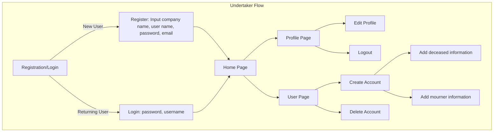
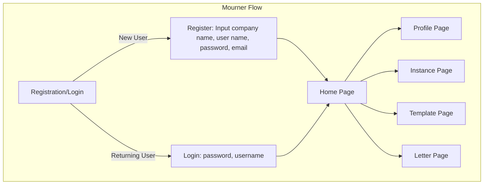

# Functional Specification Document - AfterWords <!-- omit in toc -->

 Table Of Contents 

- [Introduction](#introduction)
  - [Project Overview](#project-overview)
  - [Project Definition](#project-definition)
    - [Vision](#vision)
    - [Objectives](#objectives)
    - [Scope](#scope)
      - [In-scope](#in-scope)
      - [Out-of-scope](#out-of-scope)
    - [Target Audience](#target-audience)
    - [Deliverables](#deliverables)
    - [Definitions And Acronyms](#definitions-and-acronyms)
  - [Project Organisation](#project-organisation)
    - [Project Representatives](#project-representatives)
    - [Stakeholders](#stakeholders)
    - [Project Reviewers](#project-reviewers)
  - [Project Plan](#project-plan)
    - [Retroplanning](#retroplanning)
    - [Milestones](#milestones)
    - [Dependencies](#dependencies)
    - [Assumptions/Constraints](#assumptionsconstraints)
    - [Risks/Mitigation](#risksmitigation)
- [Use Cases and Personas](#use-cases-and-personas)
  - [Use Cases](#use-cases)
    - [Creating A New Account](#creating-a-new-account)
    - [Select Instances](#select-instances)
    - [Uploading Documents](#uploading-documents)
    - [Send Letters To All Instances](#send-letters-to-all-instances)
  - [Personas](#personas)
    - [Persona 1: Janice LeBlanc](#persona-1-janice-leblanc)
    - [Persona 2: Sean McPhil](#persona-2-sean-mcphil)
    - [Persona 3: Alexandre Moutarde](#persona-3-alexandre-moutarde)
- [Design](#design)
  - [Wireframes](#wireframes)
    - [1. Redirection Page](#1-redirection-page)
    - [2. Mourners Side](#2-mourners-side)
      - [2.1. Login Section](#21-login-section)
      - [2.2. Home Section](#22-home-section)
      - [2.3. Profile Section](#23-profile-section)
      - [2.4. Instance Section](#24-instance-section)
      - [2.5. Letters Section](#25-letters-section)
      - [2.6. Undertaker Section](#26-undertaker-section)
      - [2.7. Procedure Section](#27-procedure-section)
    - [3. Undertakers Side](#3-undertakers-side)
      - [3.1. Login Section](#31-login-section)
      - [3.2. Home Section](#32-home-section)
      - [3.3. Profile Section](#33-profile-section)
      - [3.4. Clients Section](#34-clients-section)
      - [3.5. Employees Section](#35-employees-section)
    - [4. Administrator Section](#4-administrator-section)
      - [4.1. Login Section](#41-login-section)
      - [4.2. Home Section](#42-home-section)
      - [4.3. Application Section](#43-application-section)
      - [4.4. Undertakers Section](#44-undertakers-section)
      - [4.5. Mourners Section](#45-mourners-section)
      - [4.6. Profile Section](#46-profile-section)
  - [Mockups](#mockups)
  - [Color Palette](#color-palette)
  - [Logo](#logo)
  - [Font](#font)
- [Functional Requirements](#functional-requirements)
  - [User Roles And Permissions](#user-roles-and-permissions)
    - [Administrator](#administrator)
    - [Undertakers](#undertakers)
    - [Mourners](#mourners)
  - [System Features And Functions](#system-features-and-functions)
  - [Application Workflow](#application-workflow)
- [Non-Functional Requirement](#non-functional-requirement)
- [Data Management](#data-management)
  - [Data Flow](#data-flow)
  - [Database Schema](#database-schema)
- [External Interfaces](#external-interfaces)
- [Constraints And Limitations](#constraints-and-limitations)
- [Acceptance Criteria](#acceptance-criteria)
- [Appendices](#appendices)

## Introduction

### Project Overview

---

This project is made to help mourners with the french administration system. It would be delivered to undertakers which will deliver it to mourners.

This project is held by Maxime THIZEAU.

---

### Project Definition

---

#### Vision

Afterwords is an application allowing mourning people to get some help on the administration part. \
It would ease the process by gathering all instances in one place. \
How would that work?
The mourner just have to enter all the different instances and the required documents. Once it would be done, they would have to complete some templates of letters to send them all in one click.

---

#### Objectives

---

The objectives of this project are pretty clear:

- Centralizing mourners in one platform.
- Helping mourners comnpleting french administration.
- Allowing mourners to have information gathered on one website.

---

#### Scope

##### In-scope

---

AfterwWords will cover the different subject hereunder:

- It will suggest many letters template, allowing users to have a wider range of choice to complete and write there own letters.
- It will also gather french instances (such as EDF, France connect, ...) in one place.
- Users can chose the intended instances by checking their names within a page.
- AfterWords would have a database to store all the necessary documents for the said instances above.
- AfterWords would save time and energy to mourners.

---

##### Out-of-scope

---

The following points are what AfterWords will not do:

- AfterWords won't display user's information withinvthe application.
- It would not do administartion pe=rocedures for the user.
- It won't dispose of a messagerie within the application, the user will need to have an e-mail address of there own.
- Users can't organize funerals within the application.

---

#### Target Audience

AfterWords will have to target audience. \
The first hand audience would be undertakers company. AfterWords would be a service they could share, sell to their own customers, the second and final target audience of AfterWords, mourning people.

The mourning people are the main audience of this project. AfterWords is meant to help them through a difficult pass which is grieving. However, AfterWords won't be accessible on Internet in free-access. It would be unseen, that's why undertakers have a key role in this project.

---

#### Deliverables

---

This project don't have a lot of deliverables. They are only composed of the code source and docuents that have to be written.

For the documents, there would be:

- The Functional Specifications.
- The Technical Specifications.
- The Test Plan.
- Test Cases.
- The User Manual.
- Management Artifacts.

The code source could be find in the `src` folder at the root of the project.

---

#### Definitions And Acronyms

---

<!-- - List key terms and abbreviations with their explanations.   -->

---

### Project Organisation

---

#### Project Representatives

---

This project has only one representatives which is Maxime THIZEAU, he would hold every role that a team could possibly have. However, here are the main ones:

| Role              | Description                                                                                                                          |
| ----------------- | ------------------------------------------------------------------------------------------------------------------------------------ |
| Project Manager   | Managment (time, resources) Workload distribution  Report to stakeholders Risk anticipation and mitigation                  |
| Program Manager   | Mock-ups and general design of the software Communication with the client Functional specification delivery Risk management |
| Technical Leader  | Define coding conventions Choose technical tools used Technical specification delivery Manages developer tasks              |
| Software engineer | Write the code Fix bugs Document the code Create the tests if needed for the code                                           |
| Quality assurance | Verify documents Test the program Confirm we match the client expectations Test plan delivery                               |
| Technical Writter | Put itself in user shoes User manual delivery                                                                                     |

---

#### Stakeholders

---

| Role            | Representative           | Expectation                                                              |
| --------------- | ------------------------ | ------------------------------------------------------------------------ |
| owner           | Maxime THIZEAU           | Finished project while meeting requirements and proof-tested version one |
| School director | Franck JEANNIN (ALGOSUP) | Clear documentation and management based on the skills learnt in class   |

---

#### Project Reviewers

---

This project would be reviewed by other developpers and ALGOSUP students. Moreover, you could be part of the review team by opening an issue on this repository and by following the [CONTRIBUTING document](../../CONTRIBUTING.md).

The main reviewers would be:

| Name            | Role                                                 | Personal Links                                                                                             | Company Links                                                                                                                          |
| --------------- | ---------------------------------------------------- | ---------------------------------------------------------------------------------------------------------- | -------------------------------------------------------------------------------------------------------------------------------------- |
| Evan UHRING     | Woopsie Creations Co-founder and ACS Founder         | [GitHub](https://github.com/FlouffyDaWolf)                                                                 | [Woopsie Creation GitHub](https://github.com/woopsie-creations)                                                                        |
| Enzo GUILOUCHE  | Woopsie Creations Co-founder and SeismoSense Founder | [GitHub](https://github.com/EnzoGuillouche) \| [LinkedIn](https://www.linkedin.com/in/enzoguillouche/)     | [Woopsie Creation GitHub](https://github.com/woopsie-creations) \| [SeismoSense GitHub](https://github.com/EnzoGuillouche/SeismoSense) |
| Lucas MEGNAN    | Tomodachi Sport Founder                              | [GitHub](https://github.com/LucasMegnan) \| [LinkedIn](https://www.linkedin.com/in/lucas-megnan/)          | [Tomodachi Sport](https://github.com/LucasMegnan/Tomodachi-Sport)                                                                      |
| Antoine PREVOST | Inkom Founder and CEO                                | [GitHub](https://github.com/TechXplorerFR) \| [LinkedIn](https://www.linkedin.com/in/antoine-prevost-dev/) | [Inkom](https://inkom.ai) \| [Inkom LinkedIn](https://www.linkedin.com/company/in-kom/)                                                |

---

### Project Plan

---

#### Retroplanning

---

**End Goal and Deadline**:

The project should be done (version one) before June, 2026.

**Key Milestones**:

- The Version one should be completed by the 15 of May, 2026.
- The MVP should be completed before the end of September, 2025.
- The Functional Specifications should be done by the end of July, 2025.

**Task Breakdown**:

- The Oral Presentation will be completed by the end of June, 2026.
- The User Manual will be written by the end of May, 2026
- The application would be in its first version by the end of April, 2026.
- The last Test Report will be done and written on the 12 of April, 2026.
- The Admin side of the product would be completed on the 5 of April, 2026.
- The Undertaker side would be completed by the end of February, 2026.
- The Test Plan and Test Cases would be created and completed early December, 2025.
- The MVP should be coded before October 19th, 2025.
- The Mourner Side of the application should be finished current September, 2025.
- The Technical Specification should be finished by the start of August, 2025.
- The Functional Specification should be written before July 12th, 2025.
- The Figma should be designed before the end of June, 2025.
- The Wireframe should be done before the end of June, 2025.

**Critical Path**:

This project has many critical tasks which are:

- Each side of the application (Mourners, Undertakers, Admin).
- The Technical Specifiaction.

**Timeline Visualization**:

The Gantt Chart could be seen in the [Management Artifacts Document](../management/managementArtifacts.md).

---

#### Milestones

---

| Date       | Milestones                        |
| ---------- | --------------------------------- |
| 07/12/2025 | Functional Specification Delivery |
| 08/05/2025 | Technical Specification Delivery  |
| 10/19/2025 | MVP Release                       |
| 12/03/2025 | Test Plan Delivery                |
| 12/03/2025 | Test Cases Delivery               |
| 04/25/2026 | Version One Release               |
| 05/27/2026 | User Manual Delivery              |
| 05/30/2026 | Management Artifacts Delivery     |
| 06/20/2026 | Oral Presentation Delivery        |

---

#### Dependencies

---

**Task Dependencies**:

- The Functional Specification would be only completed once the Figma (design) and Excalidraw (Wireframe) would be entirely done.
- The Last Testing phase will start only after the first version is completed.
- The First Version of the application would need all three sides to be completed.

**Resource Dependencies**:

- All resources will be available at any point in the project since only one person complete every role.
- Reviewers will be required on different testing phases lasting one to two weeks after every code advancement (Mourner Side, MVP, Undertakers Side, Admin Side).

---

#### Assumptions/Constraints

---

**Assumptions**:

- The team assume undertakers would spead the application as much as possible in their clients.
- The team assume the application will be used only by mourners having an account.
- The team assume deadlines will be met.
- The team assume connection will be provided by the client.
- The team assume mourners will have all necessary documents.
- The team assume Undertakers and client will respect the code of concuct.

**Constraints**:

- The application needs to be connected to internet.
- The application can't reach out mourners without passing by undertakers.
- The application won't be used by everyone.
- The application isn't free.
- The application should be developped in a short periiod of time.
- The team power is low.

---

#### Risks/Mitigation

---

| Type             | Description                                                    | Likelihood | Impact                                                      | Mitigation                                                                 |
| ---------------- | -------------------------------------------------------------- | ---------- | ----------------------------------------------------------- | -------------------------------------------------------------------------- |
| Sickness         | A team member becomes sick.                                    | High       | The project won't be updated while the team member is sick. | Planned more time than necessary to still be on track in case of sickness. |
| No user          | AfterWords is not appealing enough to consumers.               | Low        | The Product won'y be selled and the project obsolete.       | Having an important and efficient marketing campaign.                      |
| Data Leak        | The database leak and private information is lost on internet. | Medium     | AfterWords will lost undertakers and mourners trust.        | Having a solid data privacy and security on the database.                  |
| Unfunctional API | An API is not accessible from the application.                 | High       | This instance won't be accessible from the application.     | Finding another way to send and retrieve data from them.                   |

---

## Use Cases and Personas

### Use Cases

<!-- TODO: Add Use Cases, at least 2. And verify accuracy of already existing ones. -->

#### Creating A New Account

---

**Actor**: undertakers \
**Goal**: user wants to create an account

**Preconditions**:

- User is logged in.
- User is in the `New Account Page`.
- User has all needed mourner's personal information.

**Basic Flow**:

1. Click on `New Account`.
2. Enter deceased personal information (death date, full name, last location, birth date, birth location).
3. Enter Mourner personal information (parenthood, full name).
4. Confirm.

> [!Warning] Alternate Flows
>
> - The deceased already have an account.
> - Failed due to missing information.

**Postconditions**:

- AfterWords generate a password.
- Undertaker transmit account and password to mourner.

---

#### Select Instances

---

**Actor**: mourner \
**Goal**: user wants to contact instances

**Preconditions**:

- User is logged in.
- User is in the `Instance Page`.

**Basic Flow**:

1. Search for instance name in search bar.
2. Click the checkbox to add it to `Instance to contact`.
3. Repeat the process for every instance.

> [!Warning] Alternate Flows
> Instance not registered

**Postconditions**:

- Instance saved in `Instance to contact`.

---

#### Uploading Documents

---

**Actor**: mourner \
**Goal**: user wants to upload documents for procedure.

**Preconditions**:

- User is logged in.
- User is in the `Your Documents Page`.

**Basic Flow**:

1. Open a teb with all your documents locally.
2. Select the documents you want to upload.
3. Drag & drop them into the `Document container`.
4. Confirm the upload.

> [!Warning] Alternate Flows
>
> - The document the user want to upload already is uploaded.
> - No document given to the `Document container`.

**Postconditions**:

- Documents saved within your account.

---

#### Send Letters To All Instances

---

**Actor**: mourner \
**Goal**: user wants to inform instances of a death

**Preconditions**:

- User is logged in.
- User is in the `Letter Page`.
- User has selected the intended instances.
- User has uploaded necessary documents.

**Basic Flow**:

1. Select a category.
2. Select a template.
3. Complete blank space with personal information.
4. Confirm.

> [!Warning] Alternate Flows
>
> - Blank space empty.
> - Failed due to lack of document.
> - Failed due to unprecised/no instance.

**Postconditions**:

- Letter sent to the instance via mail.

---

### Personas

---

#### Persona 1: Janice LeBlanc

---

**Name**: Janice LeBlanc

**Age Range**: 60-90

**Frustrations**:

- Can't understand how the administration system works anymore.
- Don't know how to contact efficeietnly all of the instances needed for procedures.
- Would rather spend time with her family than doing papers.

**Goals**:

- Wants to finalize all the procedure in a shorter amount of time.
- Wants to lose less time doing procedures.
- Should understand how to do it on internet.

---

#### Persona 2: Sean McPhil

---

**Name**: Sean McPhil

**Age Range**: 35-55

**Frustrations**:

- Can't help the mourners coming to his company efficiently enough.
- Already saw people struggling completing procedural papers.
- Can't complete the work for mourners in need.

**Goals**:

- Would like to add mourners on a single application that helps them completing procedures.
- Would like to add other employees to it to have some help.
- Would like to complete procedure for those who wants it.

---

#### Persona 3: Alexandre Moutarde

---

**Name**: Alexandre Moutarde

**Age Range**: 25-45

**Frustrations**:

- Don't know all the procedures needed.
- Can't pass much time with his family due to the amount of work.
- have enough to search for every instance needed.

**Goals**:

- Would like a documented application to help him.
- Would like to spend more time grieving than doing paperworks.
- Would like having a list of steps guiding him across the procedure.

---

## Design

### Wireframes

---

<!-- TODO: insert excalidraw and describe each part/page -->

The application would be parted in three different parts, for mourners, undertakers, and administrators. Therefore, more page has been designed for all of them.

This section will start with the common redirection page and then will go through each side independently.

The wireframe (Excalidraw) can also be access as raw file in the [Design Follder](./design/designAfterWords.excalidraw).

---

#### 1. Redirection Page

---

The redirection Page will be accessible from everyone and would look like this:

---

#### 2. Mourners Side

---

Once the user has clicked on the Mourner button, they would be redirected on this section of the application. It would be composed of many sections which are:

- [Login](#21-login-section)
- [Home](#22-home-section)
- [Profile](#23-profile-section)
- [Instance](#24-instance-section)
- [Letters](#25-letters-section)
- [Undertaker](#26-undertaker-section)
- [Procedure](#27-procedure-section)

Each of those are accessible below or you can click on them to be redirected instantly to the intended section description.

---

##### 2.1. Login Section

---

This section is composed of those pages:

| Name         | Complement | Description                                                             |
| ------------ | ---------- | ----------------------------------------------------------------------- |
| Welcome Page | /          | This page is designed to welcome users into the application.            |
| Login Page   | /          | This section ask for a first name, last name, and password to the user. |
| Login Page   | Error      | Showcase potential error handling on the login page.                    |

It would look like this:

---

##### 2.2. Home Section

---

**Pages**:

| Name      | Complement | Description                                                                                          |
| --------- | ---------- | ---------------------------------------------------------------------------------------------------- |
| Home Page | /          | Center of the navigation between all pages. it also display basic information about the app/mourner. |

**Visuals**:

---

##### 2.3. Profile Section

---

**Pages**:

| Name            | Complement                     | Description                                                                                      |
| --------------- | ------------------------------ | ------------------------------------------------------------------------------------------------ |
| Profile Page    | Without Document               | Display information about user and deceased as well as an empty list of documents.               |
| Profile Page    | With Document                  | Display information about user and deceased as well as a list of documents.                      |
| Profile Pop-up  | Verification                   | Pop-up to double check before leaving the page.                                                  |
| Document Pop-up | Cancel                         | Pop-up to double check exiting the document addition.                                            |
| Document Pop-up | Phase 1 - Empty                | Pop-up with all the list of documents you need to add to your profile. The list is empty.        |
| Document Pop-up | Phase 1 - In Validation        | Appears when a document is valid and you you haven't close the pop-up.                           |
| Document Pop-up | Phase 1 - Validated            | Appears when a document is valid and after opening the pop-up a second time.                     |
| Document Pop-up | Phase 2                        | Pop-up to add documents via drag and drop or file explorer.                                      |
| Document Pop-up | Phase 2 - Error                | Pop-up displaying an error on the type of document.                                              |
| Document Pop-up | Phase 2 - New Document         | Pop-up with a form to complete to add a document which is not predefined within the application. |
| Document Pop-up | Phase 2 - New Document - Error | Pop-up displaying an error of type or field.                                                     |

**Visuals**:

---

##### 2.4. Instance Section

---

**Pages**:

| Name | Complement | Description |
| ---- | ---------- | ----------- |

**Visuals**:

---

##### 2.5. Letters Section

---

**Pages**:

| Name | Complement | Description |
| ---- | ---------- | ----------- |

**Visuals**:

---

##### 2.6. Undertaker Section

---

**Pages**:

| Name | Complement | Description |
| ---- | ---------- | ----------- |

**Visuals**:

---

##### 2.7. Procedure Section

---

**Pages**:

| Name | Complement | Description |
| ---- | ---------- | ----------- |

**Visuals**:

---

#### 3. Undertakers Side

---

As for the mourners, by clicking on the undertaker button, the user will be redirected into this side of the application. \
This one would be composed of the following sections:

- [Login](#31-login-section)
- [Home](#32-home-section)
- [Profile](#33-profile-section)
- [Clients](#34-clients-section)
- [Employees](#35-employees-section)

Each of those are written under and can be access threw the links above.

---

##### 3.1. Login Section

---

---

##### 3.2. Home Section

---

---

##### 3.3. Profile Section

---

---

##### 3.4. Clients Section

---

---

##### 3.5. Employees Section

---

---

#### 4. Administrator Section

---

Lastly, as for the two previous side, the administrator part could be access by clicking on the administrator button. \
This section will be composed of the section listed hereunder:

- Login
- Home
- Application
- Undertakers
- Mourners
- Profile

Those can be access via links or on the following section of the document.

---

##### 4.1. Login Section

---

---

##### 4.2. Home Section

---

---

##### 4.3. Application Section

---

---

##### 4.4. Undertakers Section

---

---

##### 4.5. Mourners Section

---

---

##### 4.6. Profile Section

---

---

### Mockups

---

<!-- TODO:  Figma to be done -->

---

### Color Palette

---

<!-- TODO: dark blue, purple, black, gold or white, light green, light blue, yellow, light pink -->

---

### Logo

---

<!-- TODO: Create a logo, maybe on krita -->

---

### Font

---

<!-- TODO: Inter -->

---

## Functional Requirements

### User Roles And Permissions

<!-- - Define different user roles and their access levels.   -->

#### Administrator

---

**Role owner**: Maxime THIZEAU

**Permissions**:

> [!Tip] Can
>
> - See all users.
> - See database.
> - Modify UI/UX.
> - Add new undertakers.
> - Add new instances.
> - Add new templates.

> [!Caution] Can't
>
> - See mourners' personal information.
> - Have access to uploaded documents.

---

#### Undertakers

---

**Role owners**: Undertakers

> [!Tip] Can
>
> - See users account they created.
> - Access low privacy user database (full name, deceased information).

> [!Caution] Can't
>
> - See other users accounts.
> - Access other users accounts.
> - See mourner's personal information.
> - See database.
> - Modify instances.
> - Modify templates.

---

#### Mourners

---

**Role owners**: Mourners

> [!Tip] Can
>
> - Upload documents.
> - Delete documents.
> - Search for instances.
> - Add instances.
> - Remove instances.
> - See templates.
> - Complete templates.
> - Send letters.
> - Give access to their accounts to undertakers.
> - See deceased information.
> - Add specification to deceased information.
> - Request a modification on deceased information.

> [!Caution] Can't
>
> - See database.
> - Access undertakers account.
> - Access other users account.
> - Modify deceased primary information (death date, full name, last location, birth date, birth location).

---

### System Features And Functions

<!-- - Provide detailed functional requirements, such as:
  - **Feature 1**: Description, inputs, outputs, behavior.
  - **Feature 2**: Description, inputs, outputs, behavior.
  - (Continue for all key functionalities.)   -->

---

---

### Application Workflow

---

<!-- TODO: Redo mermaids to fit excalidraw -->

---

## Non-Functional Requirement

<!-- - **Performance**: Expected response times, scalability, etc.
- **Security**: Authentication, authorization, encryption needs.
- **Usability**: UI/UX expectations, accessibility.
- **Availability and Reliability**: Uptime, fault tolerance, backups.   -->

---

---

## Data Management

### Data Flow

<!-- - Describe how data moves through the system.
- Include data flow diagrams if necessary.   -->

### Database Schema

<!-- - Define key tables and relationships if applicable.   -->

## External Interfaces

<!-- - **APIs**: Describe any APIs the system will expose or consume.
- **Third-Party Integrations**: List any integrations with external systems.
- **Hardware Interfaces**: Describe interactions with physical devices if applicable.   -->

## Constraints And Limitations

<!-- - Highlight known constraints, such as technology limitations or compliance requirements.   -->

## Acceptance Criteria

<!-- - Define what constitutes successful implementation and acceptance by stakeholders.   -->

## Appendices

<!-- - Any additional supporting information, such as diagrams, references, or links to related documents. -->
